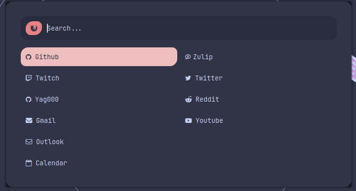

# Quick Links Rofi

## Overview

**Quick Links Rofi** is a command-line utility that generates a Rofi menu based on a user-defined input file.
This menu allows you to quickly select and open a URL in your preferred browser. It’s particularly useful for users
of tiling window managers like i3, offering a streamlined way to access frequently used links without disrupting your workflow.


This is a example of what con be achieved witht his tool :


The config files are available at: https://github.com/Yag000/dotfiles/tree/master/quick-links 

## Features

- **Custom Input File**: Define your list of links and their descriptions using a simple text file.
- **Customizable Appearance**: Apply your own Rofi theme using a theme path.
- **Custom Separators**: Use any character as a separator between link names and URLs.
- **Browser Choice**: Select your preferred web browser to open links.
- **i3 Integration**: Optional i3 window manager support for better workflow integration.
- **Configuration File Support**: Manage settings through a configuration file for a more persistent setup.

## Usage

```bash
quick-links-rofi [OPTIONS]
```

### Options

- `-i, --input-file <INPUT_FILE>`  
  Specify the input file containing the list of links. This file should be a plain text file where each line contains a link description and a URL separated by a defined separator.

- `-t, --theme-path <THEME_PATH>`  
  Set the path to the Rofi theme file.

- `-s, --separator <SEPARATOR>`  
  Define the separator character used in the input file between the link description and the URL. The default separator is `,`.

- `-b, --browser <BROWSER>`  
  Specify the web browser to open the selected link, it defaults to `firefox`.

- `i3 <I3>`
    Enable i3 window manager integration. This option should be followed by the workspace number you want to switch to after opening the link.
    It's particularly useful for users who have a dedicated workspace for their browser, allowing for a more organized and efficient workflow.
    For example, if you always open your browser in workspace 3, using --i3 3 will automatically switch to that workspace when the link is opened.

- `-h, --help`  
  Print the help message and exit.

### Configuration File Support

Quick Links Rofi also supports configuration via a YAML file. This configuration file allows you to persistently set options without needing to specify them each time you run the command.

#### Configuration File Format

Below is an example of the configuration file format:

```yaml
input_file: /home/yago/.config/quick-links/links.txt
theme: /home/yago/.config/quick-links/theme.rasi
separator: ','

workspace_switcher:
  i3:
    workspace_number: 1

browser_command_name: firefox
```

- `input_file`: The path to your input file containing the links.
- `theme`: The path to your custom Rofi theme.
- `separator`: The character used as a separator between the link description and URL in your input file.
- `workspace_switcher`: i3-specific settings to define which workspace the browser should open in.
  - `custom`: A custom command to call just before opening the URL.
  - `i3.workspace_number`: The workspace number where the browser should be opened.
- `browser_command_name`: The command to launch your preferred browser.

## Input File Format

The input file should be a plain text file where each line represents a link. Each line must follow this format:

```
<Link Description> <Separator> <URL>
```

### Example

```plaintext
GitHub,https://github.com
Google,https://www.google.com
Stack Overflow,https://stackoverflow.com
```

## Examples

### Basic Example

```bash
quick-links-rofi -i links.txt
```

This command opens a Rofi menu with the links defined in `links.txt`.

### Applying a Custom Theme

```bash
quick-links-rofi -i links.txt -t ~/.config/rofi/mytheme.rasi
```

This command applies the custom theme located at `~/.config/rofi/mytheme.rasi`.

### Using a Custom Separator

```bash
quick-links-rofi -i links.txt -s ","
```

This command uses a comma as the separator in the input file.

### Specifying a Browser

```bash
quick-links-rofi -i links.txt -b firefox
```

This command opens the selected link in Firefox.

### Using a Configuration File

If you have a configuration file set up as described earlier, you can simply run:

```bash
quick-links-rofi
```

This will use the settings defined in your configuration file, making it even easier to launch your Rofi menu with all your preferred options.

## Installation

### Crates.io

Simply run:

```bash
cargo install quick-links-rofi

```

### Manual

The above method is recommended, but if you want to install it manually, you can do it like this:

```bash
git clone git@github.com:Yag000/quick-links-rofi.git
cd wallshift
cargo build --release
```

You will now have the binary in `target/release/quick-links-rofi`

## Contributing

Contributions are welcome! Please fork the repository and submit a pull request for any enhancements or bug fixes.

## Contact

For any issues or questions, please open an issue on the GitHub repository or contact the maintainer at <quick-links-rofi@yagoiglesias.fr>
